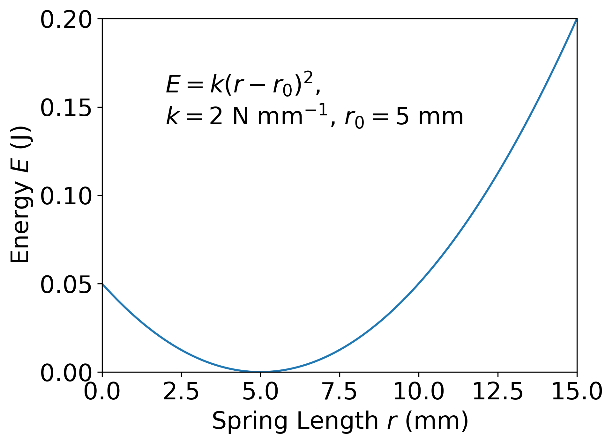

# Workshop 2: Functions and Manipulations
**Authors:** Lizzie Wheeldon and Alan M. Lewis

---

## What are Functions?

Functions describe the relationship between two values. For example, $y=2x$ means that the value of $y$ is always twice as big as the value of $x$. Functions are also commonly written using brackets to show which quantities are involved in the relationship. For example, we could write $f(x) = x^2$; this highlights that the function $f(x)$ depends on the value of $x$.

In general, we can use any symbols we like to write down functions: $\phi(z) = z^2-z+1$ and $g(\theta) = \sin{\theta}$ are both valid functions. We can also write functions which describe the relationship between multiple variables: $f(r,\theta) = r\cos{\theta}$ tells us how the value of the function changes if we change the value of either $r$ or $\theta$. Whenever we are using a function which is related to a real-life experiment, we should make sure we always define what all of the terms in our function mean. For more information about functions, see Section 1.6 of the [Maths for Chemists document](https://edu.rsc.org/download?ac=15395).

---

## Manipulating Functions

Sometimes we want to rearrange equations to make it easier to understand how one variable depends on another. We call this writing one variable as a function of other variables. We can do this by performing the same action to each side of the equation, until we are left with just the variable we are interested in by itself on one side of the equation.

For example, a very important equation in chemistry describes how gases behave. This is called the ideal gas equation, and it is:  
$$
pV = nRT
$$
where $p$ is the pressure, $V$ is the volume of the gas, $n$ is the number of moles of a gas, $T$ is the temperature, and $R$ is a constant called the gas constant. If we want to manipulate this equation so that we get a function of temperature, we can divide both sides of the equation by $nR$:  
$$
T = \frac{pV}{nR}
$$
Here, we have written $T$ as function of $p$, $V$ and $n$; $R$ is a constant.

---

## Displaying Functions on Graphs

It is often helpful to show visually how one variable depends on another using a graph. By convention, we usually do this by writing the variable we have control over (the dependent variable) on the horizontal axis of the graph, and the other variable (the independent variable) on the vertical axis. This is covered in more detail in Section 1.7 of the [Maths for Chemists document](https://edu.rsc.org/download?ac=15395).

For example, the function which describes how much energy is stored in a spring as a function of how much the spring is stretch (or squashed) is  
$$
E = k(r-r_0)^2
$$
where $E$ is the energy in the spring, $k$ is a constant called the spring constant, $r$ is the length of the spring, and $r_0$ is a constant which tells us the length of the spring when it's not stretched or squashed. That function is plotted on a graph in Figure&nbsp;1 for a $r_0 = 5$ mm spring with $k=2$ N mm$^{-1}$.
