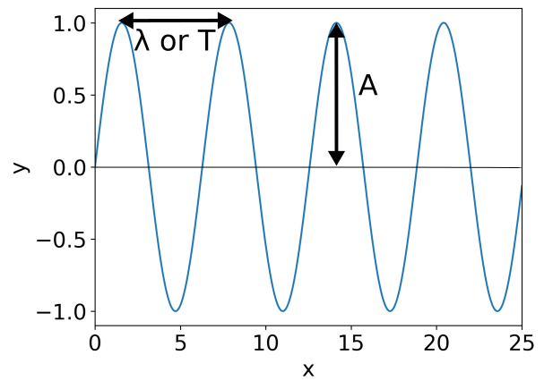

# Workshop 6: Electromagnetic Radiation and Waves  
**Authors:** Lizzie Wheeldon and Alan M. Lewis

---

For a more complete overview of electromagnetic radiation and waves please refer to [the detailed notes](https://github.com/alanmlewis/MathsforChemists/raw/refs/heads/main/notes/Waves_EM_Notes.docx).

---

## Definition of Waves

Waves describe periodic motion. We can think about waves moving through time or through space — they look the same regardless of how we think about them. This means that in Figure 1, the $x$ axis can refer to either a measure of distance, or a measure of time. If we think about a wave moving through space, the distance between the points in space where the wave peaks is called the wavelength $\lambda$; if we think about a wave moving through time, the time between the wave peaks is called the period $T$. In either case, the height of the wave is called the amplitude $A$. Waves also have a speed $c$.

From this definition of a wave, we can introduce some extra quantities. The frequency $\nu$ is the number of wave peaks which pass a given point per second, and is given by $\nu = c / \lambda$, or equivalently by $\nu = 1/T$. The wavenumber $\tilde{\nu}$ is defined as $\tilde{\nu} = 1 / \lambda = \nu / c$, and is often used in spectroscopy instead of the frequency.

---

## Interference

For illustrations of interference, please have a look at [the detailed notes](https://github.com/alanmlewis/MathsforChemists/raw/refs/heads/main/notes/Waves_EM_Notes.docx).

Waves can be added together to create a new wave. If two waves of the same frequency are added together, the new wave has the same frequency, but the amplitude depends on the relative offset of the two waves being summed. If the peaks of the two waves occur at the same place, the amplitude of the new wave is the sum of the amplitudes of the two waves — this is called constructive interference. If the peak of one wave happens at the same place as the trough of the other wave, the amplitude of the new wave is the difference between the amplitudes of the two waves — this is called destructive interference.

A special type of constructive interference produces “standing waves” — waves which move in time but are constant in space. In order to create a standing wave:
- The wave must equal zero at both ends (this could either be the at the edges of box which contains the wave, or fixed points at each end of an oscillating string).  
- The total length of the wave must be an integer multiplied by half the wavelength of the standing wave: $L = n\lambda/2$, $n = 1,2,3,\cdots$.  
- The standing wave is described as having a certain number of nodes — the number of times the wave equals zero (not counting the edges of the wave).  

---

## Electromagnetic Radiation

Electromagnetic radiation is the term for all waves which travel at the speed of light, $c = 2.998 \times 10^8$ m s$^{-1}$. This includes visible light, radio waves, UV and IR radiation, and X-rays, amongst others. The energy of electromagnetic radiation is proportion to its frequency:  
$$
E = h\nu
$$  
where $h$ is called Planck's constant, and is equal to $h = 6.626 \times 10^{-34}$ J s.

Electromagnetic radiation can also be described as particles, called photons. This is sometimes called “wave-particle duality” and is a fundamental part of quantum theory.

