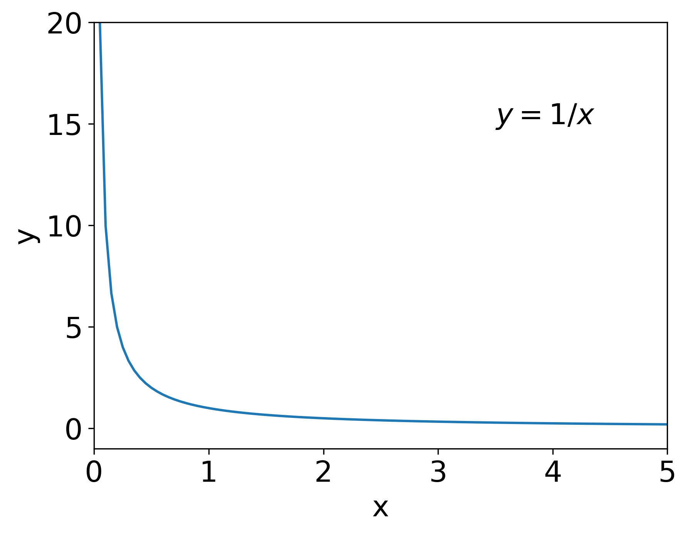

# Workshop 8: Limits and Differentiation  
**Authors:** Lizzie Wheeldon and Alan M. Lewis

---

## Limits

  

Some functions are undefined for particular values of the variable. For example, the function $f(x) = 1 / x$ equals 2 when $x = 0.5$, but what does it equal when $x = 0$? This is essentially a meaningless question — it has no answer. The best we can do is say what $f(x)$ equals as $x$ approaches 0: this is called the limit. The easiest way to think about this is to imagine plotting a graph close to the place where we want to find the limit. For example, Figure 1 shows how $y = 1/x$ changes as $x$ gets closer and closer to 0: it gets larger and larger. Therefore, we say the limit of the function as $x$ approaches 0 is infinity. Mathematically, we write this as  

$$
\lim_{x\rightarrow0} \frac{1}{x} = \infty
$$  

Some other common limits include:  

$$
\lim_{x\rightarrow\infty} x = \infty;
\quad 
\lim_{x\rightarrow\infty} \frac{1}{x} = 0;
\quad 
\lim_{x\rightarrow\infty} e^x = \infty;
\quad 
\lim_{x\rightarrow\infty} e^{-x} = 0.
$$  

If you're not sure why these limits are true, try drawing a graph of the functions and see what happens as $x$ gets larger or smaller.  

Using limits also helps us to simplify functions, and it can lead to some surprising results. For example, what happens to the function $f(x) = x/(x+1)$ as $x\rightarrow\infty$? Or, put another way, what happens to $f(x)$ when $x$ is much much larger than 1 ($x \gg 1$)? In that case, adding 1 to $x$ basically makes no difference ($\infty + 1 = \infty$), so we can write that  

$$
\lim_{x\rightarrow\infty} x + 1 = x.
$$  

Going back to our original question, we can now see that  

$$
\lim_{x\rightarrow\infty} \frac{x}{x+1}
= \lim_{x\rightarrow\infty} \frac{x}{x}
= \lim_{x\rightarrow\infty} 1
= 1.
$$  

---

## Differentiation

Differentiation is an important topic in chemistry, and is a method for calculating the gradient of a function. If a function is written as $f(x)$, its derivative is $\frac{\mathrm{d}}{\mathrm{d}x} f(x)$, or sometimes $f^\prime(x)$; if the function is labelled with $y$ or some other letter, then the derivative is usually written as $\frac{\mathrm{d}y}{\mathrm{d}x}$. If differentiation is new for you, or you need a refresher, Sections 4.1–4.5 in the [Maths for Chemists document](https://edu.rsc.org/download?ac=15395) give a really good introduction to what it is and how it's used in chemistry.  

The main rules for differentiation are summarised below:  

- If $y = ax^n$, then $\frac{\mathrm{d}y}{\mathrm{d}x} = an x^{n-1}$  
- If $y = c$ where $c$ is a constant, then $\frac{\mathrm{d}y}{\mathrm{d}x} = 0$  
- If $y = a\sin(bx)$, then $\frac{\mathrm{d}y}{\mathrm{d}x} = ab\cos(bx)$  
- If $y = a\cos(bx)$, then $\frac{\mathrm{d}y}{\mathrm{d}x} = -ab\sin(bx)$  
- If $y = ae^{bx}$, then $\frac{\mathrm{d}y}{\mathrm{d}x} = abe^{bx}$  
- If $y = a\ln(bx)$, then $\frac{\mathrm{d}y}{\mathrm{d}x} = \frac{a}{x}$  

If you have lots of terms added together in your function, you can differentiate each term in the sum separately, and then add together the derivatives to get the final answer to the derivative of the whole function.

